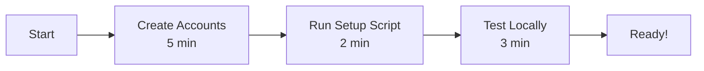

# \ud83d\ude80 Rezio SaaS - Quick Start Guide

## For Users Who Cloned This Project

> **Don't have the original credentials?** No problem! This guide gets you up and running in 15 minutes.

---

## \ud83c\udfaf Choose Your Path

### Path 1: Automated Setup (Easiest) \u2b50

**Best for:** First-time users, quick setup

```bash
# One command to set everything up
./scripts/setup-env.sh
```

This wizard will:
- \u2705 Guide you through account creation
- \u2705 Collect all your credentials
- \u2705 Create `.env` file automatically
- \u2705 Initialize your database
- \u2705 Get you ready to code!

**Time:** ~10 minutes (including account creation)

---

### Path 2: Manual Setup

**Best for:** Users who want full control

1. **Read the complete guide:**
   - Open [`SETUP_FROM_SCRATCH.md`](./SETUP_FROM_SCRATCH.md)
   - Follow step-by-step instructions
   - Create accounts manually
   - Configure everything yourself

**Time:** ~15-20 minutes

---

## \ud83d\udcc4 What You'll Need

All services are **100% FREE** with generous limits:

| Service | Purpose | Free Tier |
|---------|---------|-----------|
| [Neon.tech](https://neon.tech) | PostgreSQL Database | 10 GB storage |
| [Clerk.com](https://clerk.com) | Authentication | 10,000 users |
| [Cloudinary.com](https://cloudinary.com) | Media Storage | 25 GB storage |

---

## \u23f1\ufe0f Timeline



**Total: ~10 minutes**

---

## \ud83d\udee0\ufe0f Step-by-Step (Quick Version)

### 1\ufe0f\u20e3 Create Free Accounts (5 min)

**Neon Database:**
- Go to https://neon.tech \u2192 Sign up
- Create project \u2192 Copy connection string
- \ud83d\udcdd Save it!

**Clerk Auth:**
- Go to https://clerk.com \u2192 Sign up
- Create app \u2192 Copy API keys
- \ud83d\udcdd Save both keys!

**Cloudinary Media:**
- Go to https://cloudinary.com \u2192 Sign up
- Dashboard \u2192 Copy Cloud Name, API Key, API Secret
- Settings \u2192 Upload \u2192 Create preset: `rezio_uploads` (Unsigned!)
- \ud83d\udcdd Save all credentials!

### 2\ufe0f\u20e3 Run Setup Script (2 min)

```bash
cd /path/to/rezio-saas
./scripts/setup-env.sh
```

**Follow the prompts:**
- Paste your database connection string
- Paste your Clerk keys
- Paste your Cloudinary credentials
- Choose development mode
- Let it initialize the database

### 3\ufe0f\u20e3 Start Development (3 min)

```bash
npm run dev
```

Open browser: http://localhost:3000

**Test:**
1. Sign up with your email
2. Upload a test video
3. View it in the library
4. Download it

\u2705 **Working?** You're done!

---

## \ud83c\udfae Try It Out

### Upload a Video:
1. Go to "Video Upload" page
2. Click "Choose File"
3. Select a video (max 70MB)
4. Fill in title and description
5. Click "Upload"
6. Watch the magic happen! \u2728

### View Your Videos:
1. Go to "Home" page
2. See your uploaded videos
3. Hover for preview
4. Click download to get optimized version

---

## \ud83d\udc68\u200d\ud83d\udcbb Local Development Commands

```bash
# Install dependencies
npm install

# Generate Prisma client
npx prisma generate

# Push database schema
npx prisma db push

# Start dev server
npm run dev

# Run linter
npm run lint

# Build for production
npm run build

# Start production server
npm start
```

---

## \u2601\ufe0f Deploy to EC2

Once everything works locally:

```bash
# See full deployment guide
cat DEPLOYMENT.md

# Or use deployment script
./scripts/deploy.sh
```

**For Jenkins CI/CD:**
- Follow [`DEPLOYMENT.md`](./DEPLOYMENT.md)
- Jenkins will auto-deploy on every push!

---

## \ud83d\udd27 Available Helper Scripts

```bash
./scripts/setup-env.sh    # Interactive environment setup
./scripts/deploy.sh       # Manual deployment
./scripts/manage.sh       # Management menu
./scripts/rollback.sh     # Rollback to previous version
```

---

## \u2753 Common Issues

### "Cannot connect to database"
\u2192 Check your DATABASE_URL in `.env`  
\u2192 Ensure it ends with `?schema=public`

### "Clerk keys invalid"
\u2192 Verify you copied both keys correctly  
\u2192 Use test keys for development (`pk_test_...`)

### "Cloudinary upload failed"
\u2192 Ensure preset is **unsigned**  
\u2192 Verify preset allows video uploads

### "Port 3000 already in use"
```bash
# Kill the process using port 3000
lsof -ti:3000 | xargs kill -9
```

---

## \ud83d\udcda Full Documentation

- **Complete Setup:** [`SETUP_FROM_SCRATCH.md`](./SETUP_FROM_SCRATCH.md)
- **Deployment Guide:** [`DEPLOYMENT.md`](./DEPLOYMENT.md)
- **Quick Reference:** [`QUICK_REFERENCE.md`](./QUICK_REFERENCE.md)
- **Project README:** [`README.md`](./README.md)
- **Scripts Guide:** [`scripts/README.md`](./scripts/README.md)

---

## \u2705 Success Checklist

- [ ] Created Neon database account
- [ ] Created Clerk auth account
- [ ] Created Cloudinary account
- [ ] Ran `./scripts/setup-env.sh`
- [ ] `.env` file created
- [ ] Database initialized (`npx prisma db push`)
- [ ] Development server running (`npm run dev`)
- [ ] Can sign up/login
- [ ] Can upload videos
- [ ] Can view videos
- [ ] Ready to deploy!

---

## \ud83c\udf89 You're All Set!

**Your Rezio SaaS is ready to use!**

- Local dev: http://localhost:3000
- Production deployment: See `DEPLOYMENT.md`
- Need help? Check documentation links above

**Built by:** Kunal Rohilla  
**Contact:** kunalr.tech@gmail.com  
**GitHub:** https://github.com/Kunal061

---

**Happy Coding!** \ud83d\ude80
